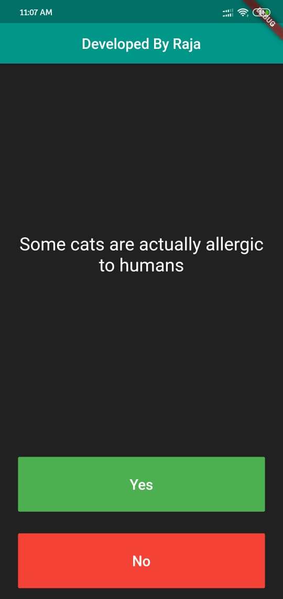
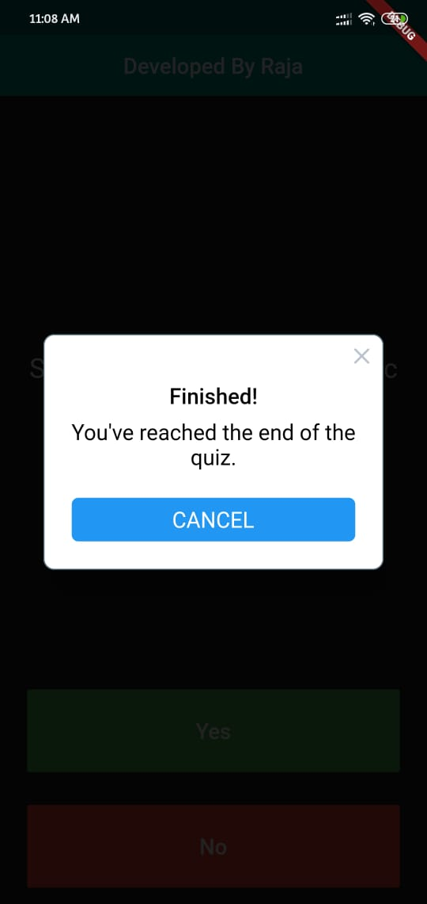

# Quizzler
Tests your general knowledge. As one of the most popular types of apps on the app stores, you can create your own quiz for other people to enjoy!

## How to Use

**Step 1:**

Download or clone this repo by using the link below:

```
https://github.com/raja53a/Quizzler.git
```
**Step 2:**

Go to project root and execute the following command in console to get the required dependencies: 

```
flutter pub get 
```
**Step 3:**

Use the flutter run command to run your Flutter app on a connected device or simulator.

```
Open a terminal and change directories to the root of app. Run the command:
flutter run
```

## Snapshot
 


